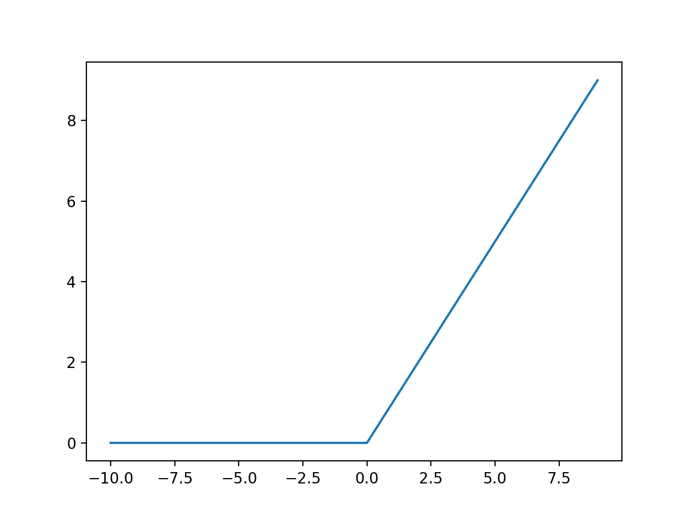

# Deep-Learning-Circle/Square-Recognition-AI (AItRCaS)
AI (programmed with Python, Tensorflow and Keras) to recognize Circles and Squares AItRCaS 


## Warum wir uns für die Programmierung von einer KI entschieden haben:

KIs übernehmen Momentan eine Menge Arbeit im Industriebereich und deren Einsatzmöglichkeiten sind sehr divers.
Im generellen spricht man von Neuronalen Netzwerken, die wie ein Menschliches Gehirn durch das Lernen bestimmte Aufgaben übernehmen können. Solche Neuronale Netzwerke die Bestimmte Strukturen wiedererkennen sollen und dann bsp. einen Wert angeben, mit welcher Wahrscheinlichkeit, wie viele Kreise zu erkennen sind oder ob überhaupt welche vorhanden sind nennt man functional neural networks.
Bilderkennung, Deepfakes und viele Aufgaben die KIs künftig übernehmen könnten. Weil KIs in unserer Gesellschaft immer größere Bedeutung finden, haben wir uns entschieden mehr darüber zu lernen.

### 1. Programmauswahl
### 2. Programme Instalieren
### 3. Erlernen der Grundlagen von KI's
### 4. Aufbau und Code der KI
### 5. Trainieren einer KI
### 6. Datenaufbereitung
### 7. Daten Erratung und Analysing
### 8. Fazit
### 9. Quellen


## 1. Programmauswahl
Zunächst haben wir uns gründlich informiert, welche Programme für das Programmieren von Ki's die einfachste Benutzung haben.

Keras ist eine Open-Source-Library zum einfachen Programmieren von neuronalen Netzwerken, die sich über den Anaconda launcher mit leichtigkeit installieren lässt. Die zentralen Merkmale der Bibliothek sind Einfachheit, Erweiterbarkeit und Modularität. Neuronale Netze können mit den bereitgestellten Lösungen erstellt und konfiguriert werden, ohne dass man sich detailliert mit den zugrunde liegenden Backends beschäftigen muss. TensorFlow unterstützt Keras direkt in seiner Kernbibliothek. 

Als Alternative gibt es Python, Scikit-learn und Docker. Wir haben bspw. Docker ausprobiert, doch Keras erwies sich aus meheren Gründen als einfacher. Auch das erstellen von virtuellen Envirements ist in Anaconda viel leichter als das Nutzen von Daemons bei Docker, zusätzlich ist der Code in Keras viel ordentlicher. Tensorflow ist ein Framework fürs programmieren von KIs mit Python und C++. Erstellt wurde es von Google und es wird auch von allen Google Diensten verwendet.Fakt ist das diese Library auch bei Scikit-learn und Docker verwendet und deshalb für das Programmieren von KIs eine zentrale Rolle spielt. 

## 2. Programme Instalieren
Das Installieren war leider einer der Schwersten Herausforderungen und auch __sehr__ Zeitaufwendig. Die verschiedenen Installationswege verwirrten und die Einrichtung von Python fehlte. Man ist immer wieder auf Probleme gestoßen. Über den Python Addon Installer Anaconda lief die Installation mehr oder wenig reibungslos. Das Nutzen der Software innerhalb des Schulunterrichts, war leider nicht möglich, bzw. das Ausführen des Codes, weil  essentielle Teile der KI sich im Programm nicht aufbauen ließen. Am Pc zuhause war das coding jedoch vollständig möglich. Nebenbei haben wir Befehle für cmd gelernt.
https://www.anaconda.com/distribution/

## 3. Erlernen der Grundlagen von KI's
Die Kenntnis über die Funktionsweise und der Aufbau von Kis waren auch von großer Bedeutung, um überhaupt mit dem Programmieren anzufangen. Über Tutorials auf YouTube, Wissenschaftlichen Papers und Internetadressen konnte viel Wissen mitgenommen werden.
Aufgelistet werden diese in unseren Quellen.

## 4. Aufbau und Code der KI
In unserem Fall programmieren wir ein CNN (Convolutional Neural Network). Diese sind insofern sinvoll, dass sie in der Lage sind Teile auf einem Bild durch bestimmte Filter zu erkennen. Deswegen werden CNNs insbesonders in der Bilderkennung verwendet. 

*Ein Convolutional Neural Network (auch „ConvNet“ genannt) ist in der Lage, Input in Form einer Matrix zu verarbeiten. Dies ermöglicht es, als Matrix dargestellte Bilder (Breite x Höhe x Farbkanäle) als Input zu verwenden. Ein normales neuronales Netz z.B. in Form eines Multi-Layer -Perceptrons (MLP) benötigt dagegen einen Vektor als Input, d.h. um ein Bild als Input zu verwenden, müssten die Pixel des Bildes in einer langen Kette hintereinander ausgerollt werden (Flattening). Dadurch sind normale neuronale Netze z.B. nicht in der Lage, Objekte in einem Bild unabhängig von der Position des Objekts im Bild zu erkennen. Das gleiche Objekt an einer anderen Position im Bild hätte einen völlig anderen Input-Vektor.*
Quelle:https://jaai.de/convolutional-neural-networks-cnn-aufbau-funktion-und-anwendungsgebiete-1691/

Ein Input ist Beispielsweise ein Bild, Video oder eine Audidatei. Frequenz und Pixel lassen sich durch Encoder in Zahlen darstellen. Mit diesen Zahlen wird im Endeffekt gerechnet. Eine KI kann man sich auch in Form einer komplizierten mathematischen Funktion vorstellen. Man gibt etwas in die Funktion hinein und bekommt etwas heraus. Das Ergebnis wird Im Output der KI angegeben. Zwischen Input und Output verbirgt sich die Struktur des Neuronalen Netzwerks. Diese Struktur lässt sich vergleichen mit einem menschlichen Gehirn. Neuronale Netzwerke bestehen aus verschiedenen Schichten (Layern). Diese besitzen eine Tiefe (Depth), deswegen spricht man auch vom Deep learning. Um die Kis effektiv trainiern zu können, verwendet man Aktivierungsfunktionen.

Die in unserem Fall wichtigen Layer sind: 
- Convolutional Layer
- Max Pooling Layer
- Flattening Layer
- Dense Layer (Densely connected Layer)

Dazwischen verbergen sich weitere Funktionen wie
- ReLU (rectified linear unit)
- Sigmoid
- Softmax

### Convolutional Layer
Haben das potenzial 


### Max Pooling Layer

### Flattening Layer

### Dense Layer (Densely connected Layer)

### ReLU (rectified linear unit)
Diese Aktivierungsfunktion ist wichtig für den Nomalization Process. Aktivierungsfunktionen können bestimmte Neuronen mit denen sie weiterverknüpft sind aktivieren (1) und deaktivieren (0). Hierbei werden negative Werte normalisiert, bzw. wird das Signal des Outputs so verändert, sodass das folgende Neuron deaktiviert wird. Zahlen größer als 0 bleiben gleich.
f(x) = max(0,x)



### Sigmoid function
Diese Aktivierungsfunktion von Sigmoid beschriebt mathematisch gesehen eine Funktion die dazu dient zu entscheiden ob ein Neuron aktiviert wird oder nicht. Bei Sigmoid kann das Neuron zwischen (1) und (0) sein. Deswegen kann man in seiner Koordinatenfunktion sehen, dass desto näher das Neuron an der (1) sich befindet, desto mehr wird es aktiviert und entgegengesetzt mit der (0). Im vergleich zur  ReLU Funktion ist sie weniger präzise.      


### Softmax function
Benutzt man wenn man eine Klasssifikation durchführen will. Bei der Berechnung passiert es immer wieder das eine Eigenschaft (ein Ergebniss) die berechnet wird, nicht nur zur einer Klasse zugeordnet wird. Zum Beispiel man hat 26 Klassen. Jede Klasse ist für ein bestimmtes Ergebniss vorhanden. Das Neuron das für eine Klasse steht muss (1) anzeigen und alle anderen 25 Klassen (0).Jetzt passieren Fehler und plötzlich zeigen 2 oder 3 Neuronen eine (1). Durch die Softmax funktion wird bestimmt, dass nur ein Neuron aktiviert werden soll und die überflüssigen deaktivieren. Damit wird gegeben, das das Ergebniss nur zur einer Klasse definiert wird. Danach geht es weiter entweder zur ReLU oder der Sigmoid function.


### Importieren der libraries bzw. der Werkzeuge die wir für das Bauen der KI brauchen. 

Als erstes brauchen wir den ImageDataGenerator, dieser erstellt mehrere Daten/Bilder aus einem Bild.
Wir brauchen außerdem ein Sequentialmodel und kein functional API Model. 
Außerdem brauchen wir Aktivierungsfunktionen damit das Neuronale Netzwerk Neuronen aktivieren und deaktivieren kann. 
Dropout ist wichtig damit zufällige Neuronen deaktiviert werden. Das ist wichtig, damit das Neuronale Netzwerk nicht overfitted/Überangepasst ist.
Flatten ist notwendig um unsere 2D Daten in 1D Arrays zu konvertieren, denn nur mit Ihnen kann die KI rechnen. 
Dense wird verwendet um ein Hidden Layer an unser Output Layer anzuhängen.
Außerdem verwenden wir natürlich Keras und Numpy. Numpy verwenden wir um unsere Arrays zu manipulieren, damit wir einfach unsere Ergebnisse in Arrays anzeigen können.
Zu guter letzt brauchen wir keras.preprocessing import image, damit unsere Bilder importieren und vorverarbeiten können.

```
from keras.preprocessing.image import ImageDataGenerator
from keras.models import Sequential
from keras.layers import Activation, Dropout, Flatten, Dense, Conv2D, MaxPooling2D
from keras import backend as K 
import numpy as np
from keras.preprocessing import image
``` 


### Image Preprocessing

``` 
img_width, img_height = 200,200

train_data_dir = 'data/train'
validation_data_dir = 'data/validation'
nb_train_samples = 1000
nb_validation_samples = 100
epochs = 50
batch_size = 20
``` 

``` 
if K.image_data_format() == 'channels_first':
    input_shape = (3, img_width, img_height)
else:
    input_shape = (img_width, img_height, 3)
    
train_datagen = ImageDataGenerator(
    rescale=1. / 255,
    shear_range=0.2,
    zoom_range=0.2,
    horizontal_flip=True)

test_datagen = ImageDataGenerator(rescale=1. / 255)

train_generator = train_datagen.flow_from_directory(
    train_data_dir,
    target_size=(img_width, img_height), 
    batch_size=batch_size,
    class_mode'binary')
    
validation_generator = test_datagen.flow_from_directory(
        validation_data_dir,
        target_size=(img_width, img_height),
        batch_size=batch_size,
        class_mode='binary')

model.fit_generator(
      train_generator,
      step_per_epoch=nb_train_samples // batch_size,
      epochs=epochs,
      validation_data=validation_generator,
      validation_steps=nb_validation_samples // batch_size)
``` 
### Aufbau des ConvNets


``` 
model = Sequential()
model.add(Conv2D(32, (3, 3), input_shape=input_shape)
model.add(Activation('relu'))
model.add(MaxPooling2D(pool_size=(2, 2)))

model.summary

model.add(Conv2D(32, (3, 3)))
model.add(Activation('relu'))
model.add(MaxPooling2D(pool_size=(2, 2)))

model.add(Conv2D(64, (3, 3)))
model.add(Activation('relu'))
model.add(MaxPooling2D(pool_size=(2, 2)))
``` 


``` 
model.add(Flatten())
model.add(Dense(64))
model.add(Activation('relu'))
model.add(Dropout(0.5))
model.add(Dense(1))
model.add(Activation('sigmoid'))
``` 


## 5. Trainieren einer KI 
Für das Trainieren einer KI nutzt man Backpropagation. Aber warum überhaupt das Training. Am Anfang ist eine Neuronales Netzwerk auf nichts spezialisiert, das Bedeutet das die KI nicht einer Funktion nachgehen kann, weil sie Dinge die sie erkennen soll nicht erkennt.
Deswegen ist das Trainieren von KIs wichtig. Jedoch muss aufgepasst werden, dass die KI nicht overfitted oder underfitted ist. Das Bedeutet, dass die KI nicht immer das selbe Bild sieht und eine richtige Antwort gibt, sondern das verschiedene wesentliche Strukturen von Bildern erkannt werden. Somit ist die KI auf eine Bestimmte Erkennung spezialisiert und nicht auf ein Bestimmtes Bild.
Die zu Veränderende Werte in der KI sind Biases und Weights.
Das Neuronale Netzwerk hat eine hohe LOSSRATE (Fehlerquote), doch dieses kann man durch das Training möglichst erniedrigen, sodass die Genauigkeit (accuracy) steigt. Gleichzeitig versucht man den Losswert möglichst gering zuhalten, dafür gibt es verschiedene Optimierungmethoden. (Optimizer)

### Optimizer


``` 
model.compile(Loss='binary_crossentropy',
      optimizer='adadelta',
      metrics=['accuracy])
``` 
## 5. Datenaufbereitung
Die Datenaufbereitung ist wenn man Software und Verständnis über das Programmieren hat, auch eine große Herausforderung.
Man brauch nähmlich ein Dataset. Dieses muss eingeteilt werden. In ein Trainingset und in ein Validationset. Dabei sollte das Validationset ungefähr 20-10% der Größe des Trainingsets entsprechen. Um zufällig diese Anzahl zu transferieren haben wir schnell ein Python Script dafür geschrieben. Somit kann das Trainieren Beginnen.
```
import os
import shutil
import fnmatch

def gen_find(filepat,top):
    print("gen_finding")
    i = 0
    for path, dirlist, filelist in os.walk(top):
        i+=1
        print("outer")
        print(i)
        j = 0
        for name in fnmatch.filter(filelist,filepat):
            j+=1
            print("inner")
            print(j)
            yield os.path.join(path,name)

# Example use
def do():
    print("doing")
    src = './data/train/Vierecke' # input
    dst = './data/validation/Vierecke' # desired location

    filesToMove = gen_find("*.png",src)
    for name in filesToMove:
        splitName = name.split(".png")[0].split('\\')[-1]
        print(splitName)
        numberAsString = splitName
        print(numberAsString)
        number = int(numberAsString)
        
        if number % 10 == 0:
            shutil.move(name, dst)
```
           
https://stackoverflow.com/questions/8155060/moving-specific-files-in-subdirectories-into-a-directory-python


## Daten Erratung und Analysing

Wir haben die Daten Erratung in einer seperat abgespeicherten Python-Datei gespeichert (output.py).
Somit müssen wir das Model erneut laden, sowie die notwendigen Libraries.
Für das Erraten eines Bilds können wir eines vom Validationset laden, dazu wird die Größe des Bildes nochmals angegeben
Zusätzlich muss das Bild in ein Array konvertiert werden, hierzu verwenden wir Numpy.
```
import numpy as np

from keras.preprocessing import image
from keras.models import load_model

model = load_model('model.h5')

img_pred = image.load_img('data/validation/test/x.png', target_size = (200, 200))
img_pred = image.img_to_array(img_pred)
img_pred = np.expand_dims(img_pred, axis = 0)
```
Das oben zu erattende Bild wird als Ergebnis definiert, dieses Ergebnis wird in der Konsole angezeigt.
Es sollte zwischen 0 und 1 liegen. Wenn das Ergebnis gleich 1 ist, soll die Konsole sagen, dass es es sich um ein Kreis handelt.
Ist das Ergebnis nicht 1, so handelt es sich um ein Viereck.
```
rslt = model.predict(img_pred)
print (rslt)
if rslt[0][0] == 1:
     prediction = "Kreis"
else:
     prediction = "Viereck"    
print (prediction) 
```
Dieses ErratungsPrinzip haben wir uns hiervon abgeschaut. https://github.com/hatemZamzam/Cats-vs-Dogs-Classification-CNN-Keras-/blob/master/cnn.py


## Fazit
## Quellen

### Download
#### https://www.anaconda.com/distribution/
#### ...
### Keras
#### https://keras.io/
#### https://keras.io/datasets/
#### https://keras.io/models/sequential/
#### https://keras.io/layers/convolutional/
#### https://keras.io/layers/core/
#### https://keras.io/layers/pooling/
#### https://keras.io/preprocessing/image/
#### https://keras.io/visualization/
#### https://keras.io/optimizers/
#### https://keras.io/applications/

### Andere Links
#### https://stackoverflow.com/questions/8155060/moving-specific-files-in-subdirectories-into-a-directory-python
#### https://www.kaggle.com/smeschke/four-shapes
#### https://github.com/hatemZamzam/Cats-vs-Dogs-Classification-CNN-Keras-/blob/master/cnn.py


### You Tube Videos + Playlist
#### https://www.youtube.com/playlist?list=PLZbbT5o_s2xq7LwI2y8_QtvuXZedL6tQU
#### https://www.youtube.com/watch?v=RznKVRTFkBY&list=PLZbbT5o_s2xrwRnXk_yCPtnqqo4_u2YGL
#### https://www.youtube.com/watch?v=aircAruvnKk&list=PLZHQObOWTQDNU6R1_67000Dx_ZCJB-3pi
#### https://www.youtube.com/watch?v=-7scQpJT7uo
#### https://www.youtube.com/watch?v=qx8l-LmdgEk
#### https://www.youtube.com/watch?v=ILsA4nyG7I0
#### https://www.youtube.com/watch?v=HMcx-zY8JSg
#### https://www.youtube.com/watch?v=oOSXQP7C7ck
#### https://www.youtube.com/watch?v=FmpDIaiMIeA
#### https://www.youtube.com/watch?v=XNKeayZW4dY&t=894s
#### https://www.youtube.com/watch?v=BqgTU7_cBnk <--


### Coole Videos zu KIs
#### https://www.youtube.com/watch?v=UWxfnNXlVy8&t=666s
#### https://www.youtube.com/watch?v=qv6UVOQ0F44
#### https://www.youtube.com/watch?v=zIkBYwdkuTk
#### https://www.youtube.com/watch?v=UWxfnNXlVy8


