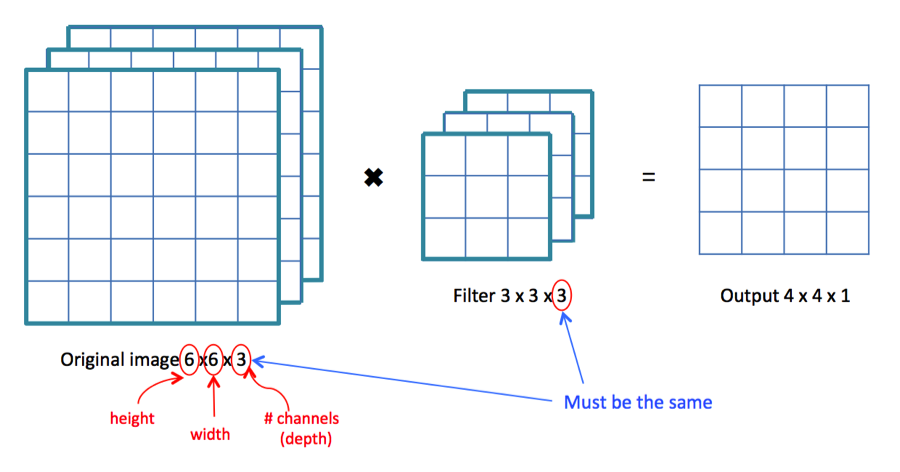
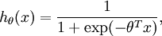

# Deep-Learning-Circle/Square-Recognition-AI (AItRCaS)
AI (programmed with Python, Tensorflow and Keras) to recognize Circles and Squares AItRCaS 


## Warum wir uns für die Programmierung von einer KI entschieden haben:

KIs übernehmen Momentan eine Menge Arbeit im Industriebereich und deren Einsatzmöglichkeiten sind sehr divers.
Im generellen spricht man von Neuronalen Netzwerken, die wie ein Menschliches Gehirn durch das Lernen bestimmte Aufgaben übernehmen können. Solche Neuronale Netzwerke die Bestimmte Strukturen wiedererkennen sollen und dann bsp. einen Wert angeben, mit welcher Wahrscheinlichkeit, wie viele Kreise zu erkennen sind oder ob überhaupt welche vorhanden sind nennt man functional neural networks.
Bilderkennung, Deepfakes und viele Aufgaben die KIs künftig übernehmen könnten. Weil KIs in unserer Gesellschaft immer größere Bedeutung finden, haben wir uns entschieden mehr darüber zu lernen.

### 1. Programmauswahl
### 2. Programme Instalieren
### 3. Erlernen der Grundlagen von KI's
### 4. Aufbau und Code der KI
### 5. Trainieren einer KI
### 6. Datenaufbereitung
### 7. Daten Erratung und Analysing
### 8. Fazit
### 9. Quellen

### [Arbeitsblog](https://github.com/LordKonstantin007/Arbeitsblog-)


## 1. Programmauswahl
Zunächst haben wir uns gründlich informiert, welche Programme für das Programmieren von Ki's die einfachste Benutzung haben.

Keras ist eine Open-Source-Library zum einfachen Programmieren von neuronalen Netzwerken, die sich über den Anaconda launcher mit leichtigkeit installieren lässt. Die zentralen Merkmale der Bibliothek sind Einfachheit, Erweiterbarkeit und Modularität. Neuronale Netze können mit den bereitgestellten Lösungen erstellt und konfiguriert werden, ohne dass man sich detailliert mit den zugrunde liegenden Backends beschäftigen muss. TensorFlow unterstützt Keras direkt in seiner Kernbibliothek. 

Als Alternative gibt es Python, Scikit-learn und Docker. Wir haben bspw. Docker ausprobiert, doch Keras erwies sich aus meheren Gründen als einfacher. Auch das erstellen von virtuellen Envirements ist in Anaconda viel leichter als das Nutzen von Daemons bei Docker, zusätzlich ist der Code in Keras viel ordentlicher. Tensorflow ist ein Framework fürs programmieren von KIs mit Python und C++. Erstellt wurde es von Google und es wird auch von allen Google Diensten verwendet.Fakt ist das diese Library auch bei Scikit-learn und Docker verwendet und deshalb für das Programmieren von KIs eine zentrale Rolle spielt. 

## 2. Programme Instalieren
Das Installieren war leider einer der Schwersten Herausforderungen und auch __sehr__ Zeitaufwendig. Die verschiedenen Installationswege verwirrten und die Einrichtung von Python fehlte. Man ist immer wieder auf Probleme gestoßen. Über den Python Addon Installer Anaconda lief die Installation mehr oder wenig reibungslos. Das Nutzen der Software innerhalb des Schulunterrichts, war leider nicht möglich, bzw. das Ausführen des Codes, weil  essentielle Teile der KI sich im Programm nicht aufbauen ließen. Am Pc zuhause war das coding jedoch vollständig möglich. Nebenbei haben wir Befehle für cmd gelernt.
https://www.anaconda.com/distribution/

## 3. Erlernen der Grundlagen von KI's
Die Kenntnis über die Funktionsweise und der Aufbau von Kis waren auch von großer Bedeutung, um überhaupt mit dem Programmieren anzufangen. Über Tutorials auf YouTube, Wissenschaftlichen Papers und Internetadressen konnte viel Wissen mitgenommen werden.
Aufgelistet werden diese in unseren Quellen.

## 4. Aufbau und Code der KI
In unserem Fall programmieren wir ein CNN (Convolutional Neural Network). Diese sind insofern sinvoll, dass sie in der Lage sind Teile auf einem Bild durch bestimmte Filter zu erkennen. Deswegen werden CNNs insbesonders in der Bilderkennung verwendet. 

*Ein Convolutional Neural Network (auch „ConvNet“ genannt) ist in der Lage, Input in Form einer Matrix zu verarbeiten. Dies ermöglicht es, als Matrix dargestellte Bilder (Breite x Höhe x Farbkanäle) als Input zu verwenden. Ein normales neuronales Netz z.B. in Form eines Multi-Layer -Perceptrons (MLP) benötigt dagegen einen Vektor als Input, d.h. um ein Bild als Input zu verwenden, müssten die Pixel des Bildes in einer langen Kette hintereinander ausgerollt werden (Flattening). Dadurch sind normale neuronale Netze z.B. nicht in der Lage, Objekte in einem Bild unabhängig von der Position des Objekts im Bild zu erkennen. Das gleiche Objekt an einer anderen Position im Bild hätte einen völlig anderen Input-Vektor.*
Quelle:https://jaai.de/convolutional-neural-networks-cnn-aufbau-funktion-und-anwendungsgebiete-1691/

Ein Input ist Beispielsweise ein Bild, Video oder eine Audidatei. Frequenz und Pixel lassen sich durch Encoder in Zahlen darstellen. Mit diesen Zahlen wird im Endeffekt gerechnet. Eine KI kann man sich auch in Form einer komplizierten mathematischen Funktion vorstellen. Man gibt etwas in die Funktion hinein und bekommt etwas heraus. Das Ergebnis wird Im Output der KI angegeben. Zwischen Input und Output verbirgt sich die Struktur des Neuronalen Netzwerks. Diese Struktur lässt sich vergleichen mit einem menschlichen Gehirn. Neuronale Netzwerke bestehen aus verschiedenen Schichten (Layern). Diese besitzen eine Tiefe (Depth), deswegen spricht man auch vom Deep learning. Um die Kis effektiv trainiern zu können, verwendet man Aktivierungsfunktionen.

Die in unserem Fall wichtigen Layer sind: 
- Convolutional Layer
- Max Pooling Layer
- Flattening Layer
- Dense Layer (Densely connected Layer)

Dazwischen verbergen sich weitere Funktionen wie
- ReLU (rectified linear unit)
- Sigmoid
- Softmax

### Convolutional Layer
Sie können bestimmte Eigenschaften von Bildern in Testsets wiedererkennen. Dazu werden die Pixel in Zahlen umgewandelt, danach werden die Zahlen mit einem Filter (bzw Feature Map) skalarmultipliziert. Die Ergebnisse werden zusammen in einer neuen Matrix gespeichert.




### Max Pooling Layer
Er reduziert die Datenmengen auf die Hälfte der vorherigen Größe (bei 2x2 Maxpooling), dabei werden nur das größte Ergebnis aus einem 2x2 Feld übernommen. Grund für die Verwendung ist die relevantesten Signale an die nächsten Schichten weiter zu geben, den Inhalts abstrakter zu machen und die Anzahl der Parameter eines Netzes zu reduzieren.


### Dense Layer und Flattening
Beim Flattening Layer (Fully Connected Layer oder Dense Layer) handelt es sich um eine normale neuronale Netzstruktur, bei der alle Neuronen mit allen Inputs und allen Outputs verbunden sind. Um den Matrix-Output der Convolutional- und Pooling-Layer in einen Dense Layer speisen zu können, muss dieser zunächst ausgerollt werden (flattening). Die Output-Signale der Filter-Schichten sind unabhängig von der Position eines Objektes, daher sind zwar keine Positionsmerkmale mehr vorhanden, dafür aber ortsunabhängige Objektinformationen.
Diese Objektinformationen werden also in einen oder mehrere Fully Connected Layer eingespeist und mit einem Output-Layer verbunden, welcher z.B. genau die Anzahl von Neuronen besitzt, die der Anzahl der verschiedenen zu erkennenden Klassen entspricht.


### ReLU (rectified linear unit)
Diese Aktivierungsfunktion ist wichtig für den Nomalization Process. Aktivierungsfunktionen können bestimmte Neuronen mit denen sie weiterverknüpft sind aktivieren (1) und deaktivieren (0). Hierbei werden negative Werte normalisiert, bzw. wird das Signal des Outputs so verändert, sodass das folgende Neuron deaktiviert wird. Zahlen größer als 0 bleiben gleich.
f(x) = max(0,x)


### Sigmoid function
Bei der Sigmoidfunktion wird der Output eines Neurons so verändert,dass dieser einen Wert zwischen (1) und (0) besitzen. Je näher der Wert an der (1) grenzt, desto eher wird das nächste Neuron aktiviert und entgegengesetzt in der Nähe von (0) deaktiviert.       


### Softmax function
Die Softmaxfunktion benutzt man wenn man eine Klasssifikation durchführen, wobei mehr als zwei Klassen vorhanden sind. Zum Beispiel hat man vier Klassen (a,b,c,d). Jede Klasse ist für ein bestimmtes Ergebniss vorhanden. Die Wahrscheinlichkeit die für eine Klasse steht muss (1=100%=Aktiviert) anzeigen und alle anderen 3 Klassen (0=0%=Deaktiviert). Unteranderem unterlaufen der KI Fehler, plötzlich weisen mehrere Klassen den Wert (1) auf. Durch die Softmax funktion wird bestimmt, dass nur ein Neuron aktiviert werden soll um die überflüssigen zu deaktivieren. Damit wird gegeben, das das Ergebniss nur zur einer Klasse definiert wird. Somit können KI's bspw. in Ziffern von 0-9 (MNIST Dataset: num_classes = 10) unterscheiden.




### MNIST Dataset


### Importieren der Libraries bzw. der Werkzeuge die wir für das Bauen der KI brauchen. 

Als erstes brauchen wir den ImageDataGenerator, dieser erstellt mehrere Daten/Bilder aus einem Bild.
Wir brauchen außerdem ein Sequentialmodel und kein functional API Model. 
Außerdem brauchen wir Aktivierungsfunktionen damit das Neuronale Netzwerk Neuronen aktivieren und deaktivieren kann. 
Dropout ist wichtig damit zufällige Neuronen deaktiviert werden. Das ist wichtig, damit das Neuronale Netzwerk nicht overfitted/Überangepasst ist.
Flatten ist notwendig um unsere 2D Daten in 1D Arrays zu konvertieren, denn nur mit Ihnen kann die KI rechnen. 
Dense wird verwendet um ein Hidden Layer an unser Output Layer anzuhängen.
Außerdem verwenden wir natürlich Keras und Numpy. Numpy verwenden wir um unsere Arrays zu manipulieren, damit wir einfach unsere Ergebnisse in Arrays anzeigen können.
Zu guter letzt brauchen wir keras.preprocessing import image, damit unsere Bilder importieren und vorverarbeiten können.

```
from keras.preprocessing.image import ImageDataGenerator
from keras.models import Sequential
from keras.layers import Activation, Dropout, Flatten, Dense, Conv2D, MaxPooling2D
from keras import backend as K 
import numpy as np
from keras.preprocessing import image
``` 


### Image Preprocessing:

Als erstes müssen die Bilder unseres Datasets gelesen werden können. Dazu geben wir die Größe (width & height) des Bildes und die Directories für das Trainings- und Validationset als Variable an.
Außerdem definieren wir die Größe des Datensatzes, also wieviele Bilder wir für das Trainieren bereitstellen. Normalerweise gibt man KIs viel mehr Bilder als es bei uns der Fall mit 1000 sind. Doch je größer so ein Datensatz ist, desto länger dauert auch das Training, dafür ist die KI im Erkennen noch präziser.
Ein kompletter Trainingsdurchlauf aller Input-Daten wird dabei jeweils als Epoche bezeichnet.
Je öfter man eine KI mit dem selben Datensatz trainiert, also je größer die Epochenanzahl, desto besser passt sich die KI der Bilder an. Dabei steigt die Genauigkeit und es sinkt die Lossrate. Epochen lassen sich zusätzlich in Batches einteilen. 
Wenn alle Batches das neuronale Netz ein Mal durchlaufen haben, ist eine Epoche vollendet. Unsere batch_size ist ein Hyperparameter der beim Trainieren die Anzahl von Samples bestimmt die durch die KI laufen, bevor ihre Parameter (Biases, Weights) geupdated werden.

``` 
img_width, img_height = 200,200

train_data_dir = 'data/train'
validation_data_dir = 'data/validation'
nb_train_samples = 1000
nb_validation_samples = 100
epochs = 15
batch_size = 20
``` 

Als nächstes müssen wir klarstellen, dass unsere Bilder im Input die richtige Form haben (channels, height, width/3x200x200) oder ( height, width,channels/200x200x3). 
Mit Channels sind bei uns die RGB Farben gemeint. Da alle Farben von Pixeln durch drei RGB-Werte definiert sind, sprechen wir bei Bildern von 3 Kanälen/Channels. 
Mit train_datagen = ImageDataGenerator erstellen wir ein noch größeres Dataset fürs Trainieren,dabei entstehen weit mehr als unseren ursprünglichen 1000 Bildern, diese sind jedoch nicht aufrufbar, es gibt aber Tools, mitwelchen man sich die von KIs veerarbeiteten Bilder anschauen kann.
Mit rescale Skalieren/Multiplizieren wir die Daten um den Faktor 1/255, bevor wie sie weiter verarbeiten. Die shear_range gibt die Scherintensität an also der Scherwinkel gegen den Urzeigersinn in Grad, mit welchem das Bild verzogen wird (siehe Scherung bei der Geometrie). Die zoom_range steht für das zufällig auftretende Reinzoomen von Bildern.
horizontal_flip dient zum zufälligen Spiegeln der Hälfte der Bilder in horizontaler Richtung. Beim Testen wird auch ein weiterer Datensatz erstellt der die Bilder nur Neuskaliert, bzw. mit dem Faktor 1/255 multipliziert.

``` 
    input_shape = (3, img_width, img_height)
else:
    input_shape = (img_width, img_height, 3)

train_datagen = ImageDataGenerator(
    rescale=1. / 255,
    shear_range=0.2,
    zoom_range=0.2,
    horizontal_flip=True)

test_datagen = ImageDataGenerator(rescale=1. / 255)

``` 
Hier erstellen wir ein Training und ein Validation Data Generator. Diese Beiden Generator führen unser Anweisungen für das Image Processing in train_datagen und test_datagen aus. Dafür muss nochmals das Verzeichnis angegeben werden, sowie die Größe des Bildes, die batch size an.
Unsere Daten lassen sich in einem 1D numpy array umschreiben, deshalb verwenden wir class_mode='binary'.

``` 
train_generator = train_datagen.flow_from_directory(
    train_data_dir,
    target_size=(img_width, img_height), 
    batch_size=batch_size,
    class_mode='binary')
    
validation_generator = test_datagen.flow_from_directory(
        validation_data_dir,
        target_size=(img_width, img_height),
        batch_size=batch_size,
        class_mode='binary')
``` 


	


### Aufbau des ConvNets
Ein neuronales Netzwerk z.B. in Form eines Multi-Layer-Perceptrons (MLP) benötigt einen Vektor als Input, d.h. um ein Bild als Input zu verwenden, müssten die Pixel des Bildes in einer langen Kette hintereinander ausgerollt werden (Flattening). In unserem Beispiel sieht man 3 fast identische Strukturen. Zu Beginn wird das Bild durch den Convolutional Layer bearbeitet. Die Parameter (31,2,2) stehen für die größe die der Layer hat und wie groß der Teil vom Bild ist der untersucht wird. Die Pixel werden in Zahlen ungewandelt und durch ein Gewicht (Feature Map) skalarmultipliziert und zu einer Matrix aufgeschrieben. Kurz darauf kommt der erste Filter zum Einsatz, die Relu Activation Funktion. Die Ereinisse die ausgerechnet wurden werden jetzt entweder normalisiert, wenn das Zwischenergebnis zwischen 0 und 1 ist wird sie 1 und wenn das Ergebnis unter 0 ist wird sie zur 0. Die danach aus den Summen entstandene Matrix wird jetzt durch den Maxpooling filter verkleinert. In unserem fall haben wir ein 2x2 kleine Matrix, die herauskommende Matrix ist demnach um das zweifache kleiner, aber dennoch sehr groß. Dieser beschriebene Prozess wird noch n-mal wiederholt (so viel, wie wir bestimmen) und dann nochmal zum Flattening Layer geleitet und danach zum Dense Layer und dann mit der Relu Funktion näher bestimmt. Damit das Neuronale Netzwerk besser angepasst ist, nutzt man Dropout. Diese Funktion deaktiviert zufällig Neuronen und reduziert die Anzahl der Neuronen um 50%. Somit lernet er über verschiedene Neuronen, dass es sich um eine bestimmte Klasse handelt. Der DenseLayer der Größe (1) wird verwendet, nicht der Dense Layer de 64er größe, da wir ein Ergebnis haben wollen, (1) für "ja" oder (0) für "nein". Zum Schluss verwenden wir die Sigmoid Funktion, da wir ein Endergebnis herausbekommen, welches weder 0 und 1 ist. So kann man durch Sigmoid definieren, dass ein Ergebnis näher zu 0, eine (0) wird und genauso andersrum. 

``` 
model = Sequential()
model.add(Conv2D(32, (3, 3), input_shape=input_shape)
model.add(Activation('relu'))
model.add(MaxPooling2D(pool_size=(2, 2)))

model.summary

model.add(Conv2D(32, (3, 3)))
model.add(Activation('relu'))
model.add(MaxPooling2D(pool_size=(2, 2)))

model.add(Conv2D(64, (3, 3)))
model.add(Activation('relu'))
model.add(MaxPooling2D(pool_size=(2, 2)))
``` 
``` 
model.add(Flatten())
model.add(Dense(64))
model.add(Activation('relu'))
model.add(Dropout(0.5))
model.add(Dense(1))
model.add(Activation('sigmoid'))
``` 


## 5. Trainieren einer KI 
Für das Trainieren einer KI nutzt man Backpropagation. Aber warum überhaupt das Training. Am Anfang ist eine Neuronales Netzwerk auf nichts spezialisiert, das Bedeutet das die KI nicht einer Funktion nachgehen kann, weil sie Dinge die sie erkennen soll nicht erkennt.
Deswegen ist das Trainieren von KIs wichtig. Jedoch muss aufgepasst werden, dass die KI nicht overfitted oder underfitted ist. Das Bedeutet, dass die KI nicht immer das selbe Bild sieht und eine richtige Antwort gibt, sondern das verschiedene wesentliche Strukturen von Bildern erkannt werden. Somit ist die KI auf eine Bestimmte Erkennung spezialisiert und nicht auf ein Bestimmtes Bild.
Die zu Veränderende Werte in der KI sind Biases und Weights.
Das Neuronale Netzwerk hat eine hohe LOSSRATE (Fehlerquote), doch dieses kann man durch das Training möglichst erniedrigen, sodass die Genauigkeit (accuracy) steigt. Gleichzeitig versucht man den Losswert möglichst gering zuhalten, dafür gibt es verschiedene Optimierungmethoden. (Optimizer)

__Wichtig!__ Erst nach dem Trainieren den Test Ordner in den Validationset Ordner packen!

### Optimizer


``` 
model.compile(Loss='binary_crossentropy',
      optimizer='adadelta',
      metrics=['accuracy'])
``` 
## 5. Datenaufbereitung
Die Datenaufbereitung ist wenn man Software und Verständnis über das Programmieren hat, auch eine große Herausforderung.
Man brauch nähmlich ein Dataset. Dieses muss eingeteilt werden. In ein Trainingset und in ein Validationset. Dabei sollte das Validationset ungefähr 20-10% der Größe des Trainingsets entsprechen. Um zufällig diese Anzahl zu transferieren haben wir schnell ein Python Script dafür geschrieben. Somit kann das Trainieren Beginnen.
```
import os
import shutil
import fnmatch

def gen_find(filepat,top):
    print("gen_finding")
    i = 0
    for path, dirlist, filelist in os.walk(top):
        i+=1
        print("outer")
        print(i)
        j = 0
        for name in fnmatch.filter(filelist,filepat):
            j+=1
            print("inner")
            print(j)
            yield os.path.join(path,name)

# Example use
def do():
    print("doing")
    src = './data/train/Vierecke' # input
    dst = './data/validation/Vierecke' # desired location

    filesToMove = gen_find("*.png",src)
    for name in filesToMove:
        splitName = name.split(".png")[0].split('\\')[-1]
        print(splitName)
        numberAsString = splitName
        print(numberAsString)
        number = int(numberAsString)
        
        if number % 10 == 0:
            shutil.move(name, dst)
```
           
https://stackoverflow.com/questions/8155060/moving-specific-files-in-subdirectories-into-a-directory-python


## Daten Erratung und Analysing

Wir haben die Daten Erratung in einer seperat abgespeicherten Python-Datei gespeichert (output.py).
Somit müssen wir das Model erneut laden, sowie die notwendigen Libraries.
Für das Erraten eines Bilds können wir eines vom Validationset laden, dazu wird die Größe des Bildes nochmals angegeben
Zusätzlich muss das Bild in ein Array konvertiert werden, hierzu verwenden wir Numpy.
```
import numpy as np

from keras.preprocessing import image
from keras.models import load_model

model = load_model('model.h5')

img_pred = image.load_img('data/validation/test/x.png', target_size = (200, 200))
img_pred = image.img_to_array(img_pred)
img_pred = np.expand_dims(img_pred, axis = 0)
```
Das oben zu erattende Bild wird als Ergebnis definiert, dieses Ergebnis wird in der Konsole angezeigt.
Es sollte zwischen 0 und 1 liegen. Wenn das Ergebnis gleich 1 ist, soll die Konsole sagen, dass es es sich um ein Kreis handelt.
Ist das Ergebnis nicht 1, so handelt es sich um ein Viereck.
__Wichtig!__ Erst nach dem Trainieren den Test Ordner in den Validationset Ordner packen!
```
rslt = model.predict(img_pred)
print (rslt)
if rslt[0][0] == 1:
     prediction = "Kreis"
else:
     prediction = "Viereck"    
print (prediction) 
```
Dieses ErratungsPrinzip haben wir uns hiervon abgeschaut. https://github.com/hatemZamzam/Cats-vs-Dogs-Classification-CNN-Keras-/blob/master/cnn.py


## Fazit
## Quellen

### Download Anaconda
#### https://www.anaconda.com/distribution/

### Keras 
#### https://keras.io/
#### https://keras.io/datasets/
#### https://blog.keras.io/building-powerful-image-classification-models-using-very-little-data.html
#### https://keras.io/models/sequential/
#### https://keras.io/layers/convolutional/
#### https://keras.io/layers/core/
#### https://keras.io/layers/pooling/
#### https://keras.io/preprocessing/image/
#### https://keras.io/visualization/
#### https://keras.io/optimizers/
#### https://keras.io/applications/


### Andere Links
#### https://stackoverflow.com/questions/8155060/moving-specific-files-in-subdirectories-into-a-directory-python
#### https://www.kaggle.com/smeschke/four-shapes
#### https://github.com/hatemZamzam/Cats-vs-Dogs-Classification-CNN-Keras-/blob/master/cnn.py
#### https://www.tensorflow.org/
https://jaai.de/convolutional-neural-networks-cnn-aufbau-funktion-und-anwendungsgebiete-1691/


### You Tube Videos + Playlist
#### https://www.youtube.com/playlist?list=PLZbbT5o_s2xq7LwI2y8_QtvuXZedL6tQU
#### https://www.youtube.com/watch?v=RznKVRTFkBY&list=PLZbbT5o_s2xrwRnXk_yCPtnqqo4_u2YGL
#### https://www.youtube.com/watch?v=aircAruvnKk&list=PLZHQObOWTQDNU6R1_67000Dx_ZCJB-3pi
#### https://www.youtube.com/watch?v=-7scQpJT7uo
#### https://www.youtube.com/watch?v=qx8l-LmdgEk
#### https://www.youtube.com/watch?v=ILsA4nyG7I0
#### https://www.youtube.com/watch?v=HMcx-zY8JSg
#### https://www.youtube.com/watch?v=oOSXQP7C7ck
#### https://www.youtube.com/watch?v=FmpDIaiMIeA
#### https://www.youtube.com/watch?v=XNKeayZW4dY&t=894s


### Coole Videos zu KIs
#### https://www.youtube.com/watch?v=UWxfnNXlVy8&t=666s
#### https://www.youtube.com/watch?v=qv6UVOQ0F44
#### https://www.youtube.com/watch?v=zIkBYwdkuTk
#### https://www.youtube.com/watch?v=UWxfnNXlVy8


